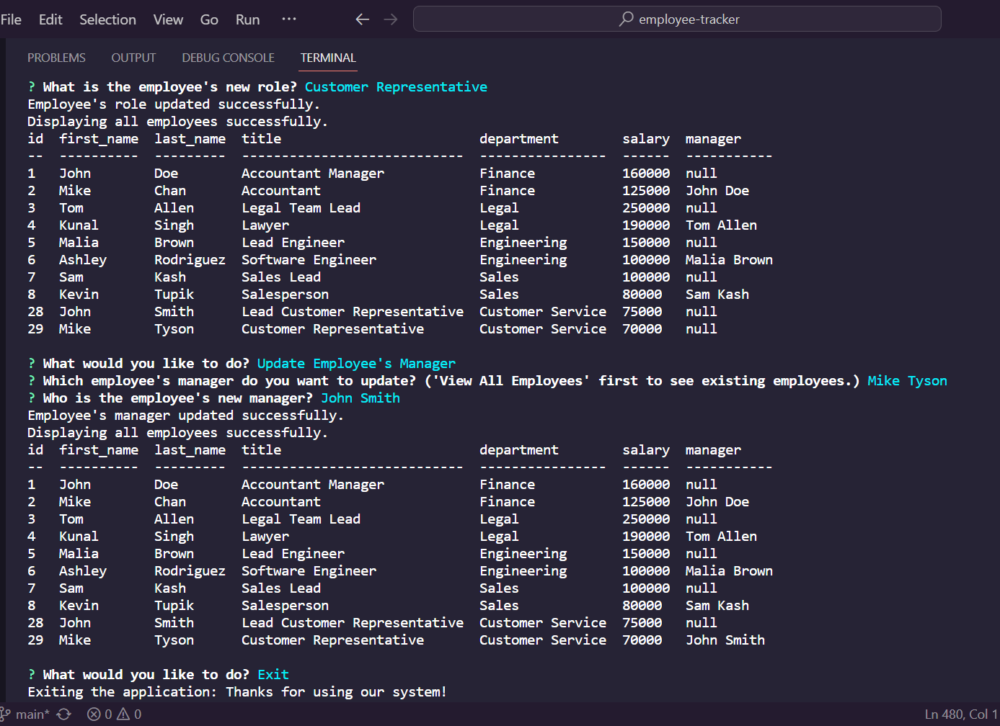

# Employee-Tracker


## Table of Contents

- [Description](#description)
- [Technologies](#technologies)
- [Installation](#installation)
- [Usage](#usage)
- [License](#license)


## Description

This project amims to build a command-line application from scratch to manage a company's employee database, using Node.js, Inquirer, and MySQL.


## Technologies

- JavaScript (Client-side web development)
- Node.js (A runtime environment and server-side web development platform for JavaScript)
- NPM (Node Package Manager for Node.js)
- JSON (JavaScript Object Notation is a standard text-based format for representing structured data based on JavaScript object syntax)
- Inquirer (Inquirer is a Node.js library that simplifies creating interactive command-line interfaces by providing prompts for user input and choices.)
- MYSQL (Open-source relational database management)


## Installation

```md
In order to be able to run the applicaton, you are required to do the following:

- Install Node.js on your computer by downloading it from their website here, https://nodejs.org/en.
- If you are not sure how to install it. Click here for the instruction, https://coding-boot-camp.github.io/full-stack/nodejs/how-to-install-nodejs.
- Download the zip file/ clone the GitHub repo 
- Install npm (Node Package Manager) inside the repo by typing the following code in the command line:

 $ npm install
 ```


## Usage

To use the application,
- You need to do, "npm install" if you haven't done in the Installation section above.
- Open the folder in VSCode
- Click the "Toggle Panel" on the right-side or "Ctrl+J" to see the Terminal or Command Line Interface(CLI)
- Type:
```md
npm start or node app.js    in the command line
```
- Then, take action based on the Prompts option
- Watch the walkthrough video. [Click here](https://drive.google.com/file/d/1ccQUpSUB7mIgQUvrM_7_txxJu9rIuw23/view)

Tips: How to Force Exit out of the app?
- Firstly, click on the Command Line
- Then, Press Ctrl + C (Windows) and Command + C (Mac)

Preview the screenshot:



## License

This project is under the MIT License. [Click here for more information](https://opensource.org/licenses/MIT).
